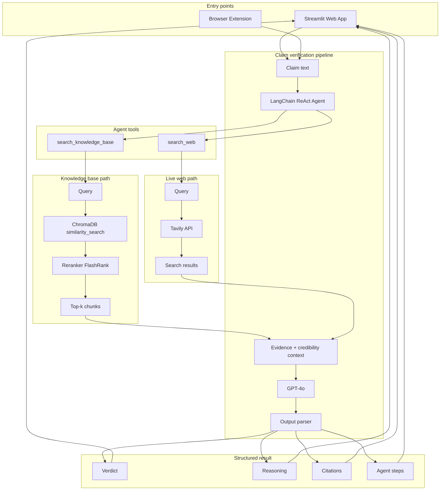
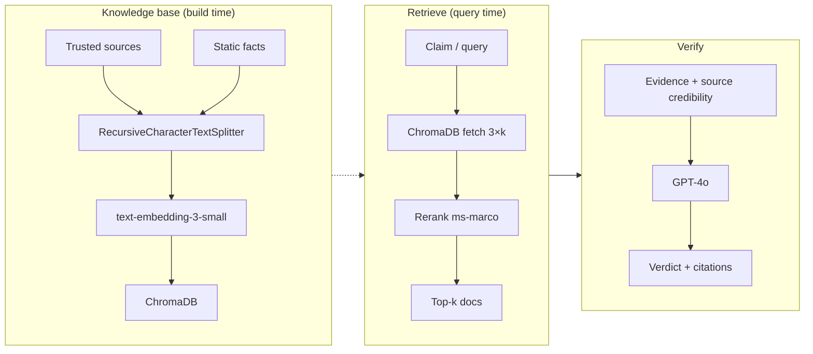
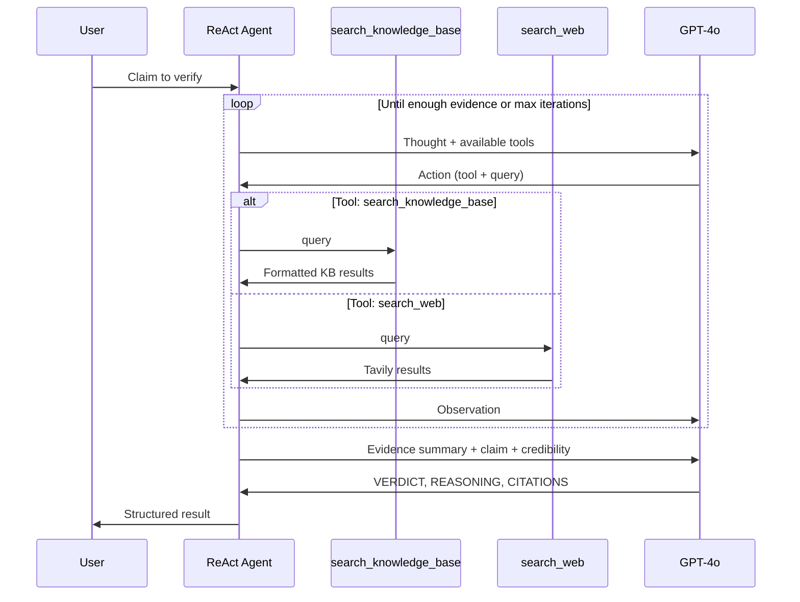

# 🔍 AI Claim Verifier
### AI League Hackathon #1 — RAG / Agentic RAG

A Real-Time News Claim Verification System powered by **GPT-4o**, **LangChain**, and **ChromaDB**.

---

## 🏗️ Architecture

### Verification flow (runtime)



### RAG components detail



### Agentic loop (ReAct)



---

## 🛠️ Tech Stack

| Component | Tool |
|-----------|------|
| Frontend | Streamlit |
| LLM | GPT-4o |
| Embeddings | text-embedding-3-small |
| Vector DB | ChromaDB |
| Web Search | Tavily API |
| Framework | LangChain |

---

## 🚀 Setup Instructions

### 1. Clone & Navigate
```bash
cd ai-league-hackathon/claim-verifier
```

### 2. Create Virtual Environment
```bash
python -m venv venv

# On Windows:
venv\Scripts\activate

# On Mac/Linux:
source venv/bin/activate
```

### 3. Install Dependencies
```bash
pip install -r requirements.txt
```

### 4. Set Up API Keys
```bash
# Copy the example env file
cp .env.example .env

# Edit .env and fill in your keys:
# OPENAI_API_KEY=sk-****
# TAVILY_API_KEY=tvly-****
```

Get your keys:
- **OpenAI**: https://platform.openai.com/api-keys
- **Tavily**: https://tavily.com (free tier)

**Optional — grow KB from web results:** After each verification, you can add some of the web search results into the knowledge base so it grows over time. In `.env` set `ENABLE_KB_UPDATE_FROM_WEB=true`. You can also set `KB_UPDATE_MAX_DOCS_PER_RUN=3` (max documents added per run) and `KB_UPDATE_ONLY_WHEN_VERDICT_NOT_UNKNOWN=true` (only add when the verdict is not "NOT ENOUGH EVIDENCE"). Duplicate URLs are skipped.

### 5. Build the Knowledge Base (Run Once)
```bash
# Full build (scrapes web + loads static facts)
python scripts/build_knowledge_base.py

# Fast build (static facts only, good for testing)
python scripts/build_knowledge_base.py --no-web
```

### 6. Run the App
```bash
streamlit run app.py
```

Open your browser at: **http://localhost:8501**

### 7. Deploy (optional)

To run the app on a public URL (for the browser extension or sharing):

- **Streamlit Community Cloud** — Connect your GitHub repo, set root to `claim-verifier`, add secrets, deploy. Free.
- **Docker** — From `claim-verifier/`: `docker build -t claim-verifier .` then `docker run -p 8501:8501 -e OPENAI_API_KEY=... -e TAVILY_API_KEY=... claim-verifier`. Persist the KB with `-v claim-verifier-data:/app/data`.
- **Railway / Render / Fly.io** — Deploy the Dockerfile; set env vars and use the generated URL in the extension.

See **[claim-verifier/DEPLOYMENT.md](claim-verifier/DEPLOYMENT.md)** for step-by-step instructions.

---

## 📁 Project Structure

```
claim-verifier/
├── app.py                          # Streamlit UI
├── requirements.txt                # Dependencies
├── .env.example                    # API keys template
├── .gitignore
│
├── rag_engine/
│   ├── agent.py                    # LangChain ReAct Agent
│   ├── tools.py                    # KB Search + Web Search tools
│   ├── knowledge_base.py           # ChromaDB operations
│   └── prompts.py                  # Prompt templates
│
├── utils/
│   ├── embeddings.py               # OpenAI embeddings setup
│   ├── chunker.py                  # Text splitting logic
│   └── output_parser.py            # Parses AI verdict output
│
├── data/
│   └── chroma_db/                  # ChromaDB data (auto-created)
│
└── scripts/
    └── build_knowledge_base.py     # Populates ChromaDB
```

---

## 🎯 Verdict Types

| Verdict | Meaning |
|---------|---------|
| ✅ TRUE | Claim is supported by evidence |
| ❌ FALSE | Claim is contradicted by evidence |
| ⚠️ PARTIALLY TRUE | Claim is partially correct |
| 🔍 NOT ENOUGH EVIDENCE | Cannot verify with available sources |

---

## 📦 Deliverables Checklist

- [x] Working demo application (Streamlit)
- [x] Architecture diagram (see above)
- [x] Embedding model: `text-embedding-3-small` (OpenAI)
- [x] Vector DB: ChromaDB (local, persistent)
- [x] Chunking: RecursiveCharacterTextSplitter (500 chars, 50 overlap)
- [x] Knowledge base: Static facts + web-scraped articles
- [x] Verification logic: Agentic RAG with ReAct loop
- [x] Always cites sources
- [x] Never fabricates sources
- [x] Returns "Not Enough Evidence" when appropriate
