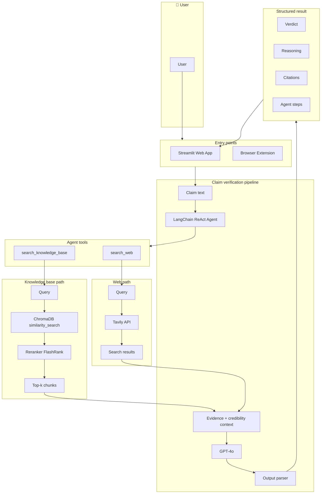
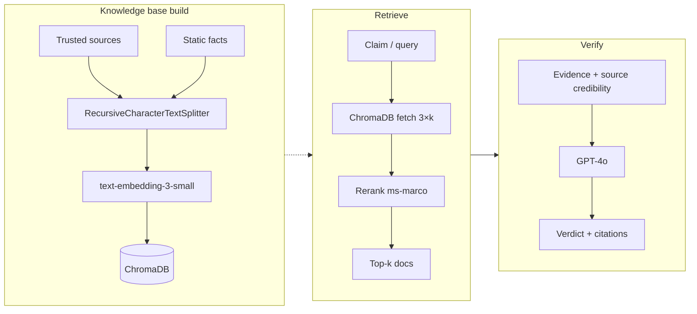

# Claim Verifier — Design Document

This document describes the architecture, RAG flow, and technical choices behind the Real-Time News Claim Verification system.
### [Architecture Diagram](https://app.eraser.io/workspace/OJaioGMLlpSmIvTyHJ5I)

---

## 1. Architecture diagram (RAG flow + components)

### 1.1 High-level architecture

The diagram below shows how a claim moves from the user through the system to a structured verdict.

### 1.2 RAG components (embedding, chunking, rerank)

This diagram shows the **knowledge base build** (one-time or periodic), **retrieve** (at query time), and **verify** (LLM + parser) stages.

---

## 2. Technical explanation

### 2.1 Embedding model used

**Model:** **OpenAI `text-embedding-3-small`**

- **What it does:** Converts any text (a sentence, a paragraph, or a chunk of an article) into a list of numbers (a *vector*). Similar meanings produce similar vectors, so we can find “nearby” chunks in the knowledge base for a given claim.
- **Why this model:** It’s fast, cost-effective, and works well for semantic search. We use the same OpenAI API key as for GPT-4o.
- **Where it’s used:** When we add documents to the knowledge base, each chunk is embedded and stored in ChromaDB. At query time, the claim is embedded and compared to stored chunks to fetch the most similar ones.

---

### 2.2 Vector DB (if used)

**Database:** **ChromaDB**

- **What it does:** Stores the embedded chunks (vectors) and lets us run *similarity search*: given the claim’s vector, it returns the chunks whose vectors are closest (e.g. by cosine similarity).
- **Why ChromaDB:** It’s open-source, runs locally (or in the same container as the app), and persists data to disk under `data/chroma_db`. No separate database server is required.
- **How we use it:** One collection, `claim_verifier_kb`. We fetch more candidates than we need (e.g. 3× the desired `k`), then rerank them (see below) and return the top `k` chunks to the agent.

---

### 2.3 Chunking strategy (if used)

**Strategy:** **RecursiveCharacterTextSplitter** (LangChain)

- **What it does:** Splits long documents into smaller pieces (*chunks*) before embedding and storing. It tries to split in a sensible order: first by paragraphs (`\n\n`), then by lines (`\n`), then by sentences (`. `), then by words, so chunks stay as readable as possible.
- **Parameters we use:**
  - **Chunk size:** 300 characters (max length per chunk).
  - **Chunk overlap:** 40 characters so that a sentence or phrase that crosses a boundary is still present in two adjacent chunks, reducing loss of context at edges.
- **Why chunk:** A full article can cover many topics; one big embedding is less precise. Smaller chunks give more targeted retrieval, and overlap helps when the claim relates to text that sits on a chunk boundary.

---

### 2.4 Reranking approach (if used)

**Approach:** **FlashRank** with model **`ms-marco-MiniLM-L-12-v2`**

- **What it does:** ChromaDB returns chunks by *vector similarity* (fast but not always the best match to the exact claim). The reranker does a second pass: it scores each candidate chunk for *relevance to the specific query* and we keep only the top `k`.
- **Why rerank:** Vector similarity can pull in chunks that are “close” in embedding space but not directly relevant to the claim. Reranking improves precision so the agent sees the most on-topic evidence.
- **Flow:** We request up to `min(k × 3, 12)` candidates from ChromaDB, then rerank them with FlashRank and return the top `k` (e.g. 3 or 4) to the agent. The model runs locally in the app (no extra API).

---

### 2.5 Knowledge base design + live web validation strategy (Static GK vs current affairs)

**Knowledge base design**

- **Static / general knowledge (GK):**
  - **Static facts:** Curated short facts (e.g. “India banned TikTok on …”, “Chandrayaan-3 landed on …”) loaded from a list in code. No web scrape; always available and stable.
  - **Trusted sources:** We also load content from trusted URLs (fact-check sites like Snopes, FactCheck.org, Politifact; Wikipedia pages; BBC News; ICC rankings pages) via a one-time or periodic build script. This content is chunked, embedded, and stored in ChromaDB. Good for established facts and background.
- **Current affairs:** The KB is built ahead of time and not updated on every request. So for *current* news (today’s headlines, latest rankings, recent events), we don’t rely only on the KB.

**Live web validation strategy**

- **Tavily API:** The agent has a **search_web** tool that calls the Tavily API. For claims that need up-to-date information, the agent runs one or more web searches (different queries) and gets snippets and links from live results.
- **How we combine:**
  - **Static GK:** KB search first (fast, no extra API for retrieval). Use for historical facts, definitions, and well-established events.
  - **Current affairs:** Agent is instructed to do multiple web searches (e.g. at least 2–3), to include “latest” or year in the query when relevant, and to prefer the most recent source when sources conflict. Verdict prompts tell the LLM to state the date of the data and to say “NOT ENOUGH EVIDENCE” or “PARTIALLY TRUE” when evidence is old or missing.
- **Optional KB growth:** We can optionally add some web search results back into ChromaDB after verification (e.g. when verdict is not “NOT ENOUGH EVIDENCE”) so the KB gradually improves for future queries.

---

### 2.6 Verification / validation logic

**Two-phase flow**

1. **Evidence gathering (agentic):**
   - A **LangChain ReAct agent** (GPT-4o) receives the claim and has two tools: **search_knowledge_base** and **search_web**.
   - The agent is instructed to: (1) search the KB first, (2) do at least 2–3 web searches with different queries, (3) search again if sources conflict or for “current” topics (rankings, latest news), (4) note dates of sources, and (5) not fabricate sources. It runs for up to a fixed number of steps (e.g. 8).
   - All tool outputs (KB chunks + web results) are combined into one **evidence** text.

2. **Source credibility:**
   - URLs found in the evidence are passed through a **source credibility** module that assigns tiers (e.g. authoritative, reliable, moderate, low). A short “credibility guide” string is appended to the evidence so the LLM can weight sources (e.g. prefer WHO over a random blog).

3. **Verdict generation:**
   - The combined **evidence + credibility context** is sent to GPT-4o with a **verification prompt** that enforces: (1) never fabricate sources, (2) cite only what appears in the evidence, (3) if evidence is insufficient, respond “NOT ENOUGH EVIDENCE”, (4) prefer the most recent source when sources conflict, and (5) output in a fixed format: VERDICT, CONFIDENCE, REASONING, CITATIONS, EVIDENCE QUALITY.

4. **Structured output:**
   - The model’s text response is parsed by an **output parser** that extracts VERDICT (TRUE / FALSE / PARTIALLY TRUE / NOT ENOUGH EVIDENCE), CONFIDENCE, REASONING, CITATIONS (source, URL, snippet), and EVIDENCE QUALITY. This is what the UI and any API return.

**Constraints enforced**

- **Always cite sources:** The prompt and parser are built so that citations come only from tool results; the model is told not to invent URLs or sources.
- **No fabrication:** Instructions and format constrain the model to use only provided evidence.
- **“Not enough evidence”:** When evidence is missing or too weak, the model is instructed to return that verdict and the parser supports it; the UI displays it clearly.

---

## 3. Summary table

| Topic | Choice |
|--------|--------|
| **Embedding model** | OpenAI `text-embedding-3-small` |
| **Vector DB** | ChromaDB (persistent, local/container) |
| **Chunking** | RecursiveCharacterTextSplitter; 300 chars, 40 overlap; separators paragraph → line → sentence → word |
| **Reranking** | FlashRank, model `ms-marco-MiniLM-L-12-v2`; fetch 3×k from ChromaDB, rerank, return top k |
| **Knowledge base** | Static facts + scraped trusted sources (fact-check, Wikipedia, news, ICC); optional growth from web results |
| **Live web** | Tavily API via agent tool; multiple queries for current affairs; date-aware and conflict handling in prompt |
| **Verification logic** | ReAct agent (KB + web) → evidence + credibility → single GPT-4o verification call → structured parser → verdict + reasoning + citations |
