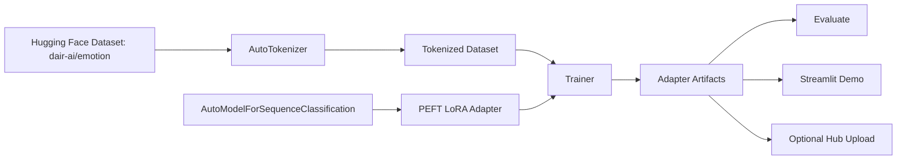

# Open Source Fine-Tuning Lab

This project fills the L1 focus area **Open Source LLM Ecosystems and Basic Fine-Tuning**. It is a compact, CPU-first Hugging Face and PyTorch lab that fine-tunes `distilbert-base-uncased` with a LoRA adapter on the `dair-ai/emotion` dataset, evaluates the adapter, and serves it through a local Streamlit demo.

## Interview Story

Open Source Fine-Tuning Lab is an end-to-end workflow for supervised fine-tuning with open-source tools. I use Hugging Face Datasets to load `dair-ai/emotion`, Transformers to load `AutoTokenizer` and `AutoModelForSequenceClassification`, PyTorch for tensor/device-aware training, and PEFT/LoRA to fine-tune only a small number of adapter parameters instead of all DistilBERT weights. The project saves a local adapter, evaluates it with accuracy/F1/confusion matrix, includes a model card, and has an optional script to upload the adapter to Hugging Face Hub. A Streamlit demo shows local inference, tokenizer output, confidence scores, and device details.

## What This Covers

| Assessment area | Project evidence |
|---|---|
| Hugging Face ecosystem | Uses Hub model IDs, Datasets, Transformers, PEFT, model card, optional Hub upload, and Spaces-ready Streamlit app |
| PyTorch basics | `scripts/pytorch_basics.py` demonstrates tensors, dtypes, shapes, DataLoader, `.to(device)`, train/eval loops, `backward()`, `step()`, and `torch.no_grad()` |
| Basic supervised fine-tuning | `scripts/train_lora_classifier.py` runs LoRA fine-tuning with train/validation splits, early stopping, metrics, and saved adapters |
| Open-source vs proprietary trade-offs | `docs/OPEN_SOURCE_VS_PROPRIETARY.md` covers privacy, compliance, cost, latency, quality, governance, and maintenance |

## Architecture



## Setup

```bash
cd open-source-finetuning-lab
python3 -m venv venv
source venv/bin/activate
pip install -r requirements.txt
```

Optional Hugging Face upload:

```bash
cp .env.example .env
# Edit HF_TOKEN and HF_REPO_ID
```

## Run the Project

PyTorch fundamentals:

```bash
python3 scripts/pytorch_basics.py
```

Fast smoke fine-tuning:

```bash
python3 scripts/train_lora_classifier.py --smoke
```

Full fine-tuning:

```bash
python3 scripts/train_lora_classifier.py --epochs 3
```

Evaluate the saved adapter:

```bash
python3 scripts/evaluate.py --model-dir outputs/emotion-lora
```

Run the local demo:

```bash
streamlit run app.py
```

Optional Hub upload:

```bash
python3 scripts/push_to_hub.py --repo-id your-username/emotion-lora-distilbert
```

## Project Structure

```text
open-source-finetuning-lab/
├── app.py
├── requirements.txt
├── pyproject.toml
├── MODEL_CARD.md
├── L1_OPEN_SOURCE_LLM_FINE_TUNING_EVALUATION_PREP.md
├── docs/
│   ├── OPEN_SOURCE_VS_PROPRIETARY.md
│   └── QLORA_NOTES.md
├── scripts/
│   ├── pytorch_basics.py
│   ├── train_lora_classifier.py
│   ├── evaluate.py
│   └── push_to_hub.py
├── src/osft_lab/
│   ├── config.py
│   ├── dataset_utils.py
│   ├── device.py
│   ├── inference.py
│   ├── lora_utils.py
│   └── metrics.py
└── tests/
    ├── test_dataset_utils.py
    ├── test_device.py
    ├── test_inference.py
    └── test_lora_utils.py
```

## Hugging Face Concepts to Explain

- **Hub:** central place for models, datasets, Spaces, model cards, versions, files, and community discussion.
- **Model IDs:** `distilbert-base-uncased` and `dair-ai/emotion` are resolved through `from_pretrained()` and `load_dataset()`.
- **Datasets:** `load_dataset("dair-ai/emotion")` returns train/validation/test splits with text and label columns.
- **Transformers:** `AutoTokenizer` converts text to token IDs and attention masks; `AutoModelForSequenceClassification` loads the classifier architecture.
- **PEFT/LoRA:** adds trainable low-rank adapter matrices to attention projection layers while freezing most base weights.
- **Model card:** `MODEL_CARD.md` documents intended use, limits, data, metrics, and ethical considerations.
- **Spaces:** the Streamlit `app.py` can be deployed as a Hugging Face Space after the adapter is available on the Hub.

## Fine-Tuning Choices

- **Task:** emotion classification, a supervised learning problem with labeled examples.
- **Base model:** DistilBERT, small enough for local learning and fast enough for demos.
- **LoRA rank:** `r=8`, a conservative L1 default that adds capacity without training too many parameters.
- **Target layers:** DistilBERT attention projections `q_lin` and `v_lin`, because query/value projections are common LoRA targets for adapting attention behavior.
- **Overfitting controls:** validation split, early stopping, weight decay, small learning rate, and evaluation metrics.
- **Device handling:** CUDA first, Apple MPS second, CPU fallback.

## Local Tests

The helper tests use standard-library `unittest` so they run even before installing ML dependencies:

```bash
PYTHONPATH=src python3 -m unittest discover -s tests -q
```

From the repository root:

```bash
PYTHONPATH=open-source-finetuning-lab/src python3 -m unittest discover -s open-source-finetuning-lab/tests -q
```

## References

- Hugging Face Hub docs: https://huggingface.co/docs/hub
- Hugging Face Datasets loading docs: https://huggingface.co/docs/datasets/en/loading
- Transformers PEFT docs: https://huggingface.co/docs/transformers/peft
- Hugging Face model card docs: https://huggingface.co/docs/hub/model-cards
- PyTorch quickstart: https://docs.pytorch.org/tutorials/beginner/basics/quickstart_tutorial.html
- PyTorch CUDA/device notes: https://docs.pytorch.org/docs/main/notes/cuda.html
