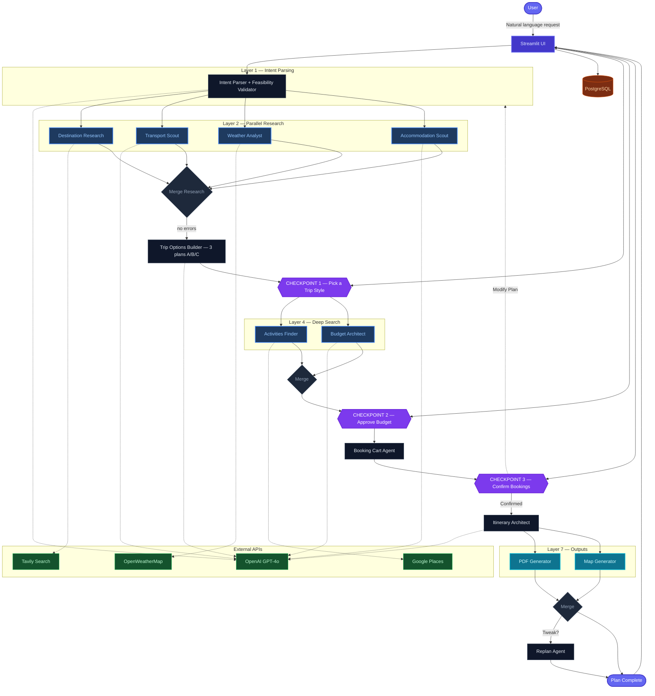

# AI Travel Planning & Booking Agent

An autonomous multi-agent system that plans, researches, optimizes, and coordinates end-to-end travel itineraries. Give it a natural-language request like *"Plan a 10-day trip to New York for 4 people, budget ₹2L, from Delhi"* and it delivers a complete, reviewable, actionable trip package — day-by-day itinerary, budget breakdown, booking-ready options, downloadable PDF, and an interactive route map.

Built with **LangGraph** (parallel agent orchestration), **GPT-4o** (reasoning), **Streamlit** (UI), and **PostgreSQL** (trip history).

---

## Key Features

- **Intent Parsing** — Extracts destination, budget, duration, travel style, interests, and number of travelers from free text
- **Feasibility Validation** — Catches unrealistic inputs (e.g., ₹100 budget for NYC) and auto-adjusts with clear warnings
- **Parallel Research** — 4 agents run simultaneously: destination research (Tavily), transport (GPT-4o), weather (OpenWeatherMap), accommodation (GPT-4o)
- **3 Plan Options** — Balanced Explorer / Budget Maximizer / Experience First, each with realistic cost breakdowns
- **3 Human-in-the-Loop Checkpoints** — Pick a plan → Approve budget (sliders) → Confirm bookings (or modify)
- **Real Activity Prices** — Google Places for real attractions, GPT-4o estimates actual ticket prices
- **Traveler-Aware Pricing** — Costs scale with number of travelers and rooms needed
- **Downloadable PDF Itinerary** — Generated with ReportLab
- **Interactive Route Map** — Folium + Geopy with markers for every stop
- **Trip History** — Completed plans saved to PostgreSQL, loadable from the sidebar
- **Replan / Tweak** — "Make it cheaper", "Better hotel", or custom changes without restarting

---

## Architecture Diagram



---

## Project Structure

```
travel-agent/
├── app/
│   ├── main.py                  # Streamlit UI — session state, checkpoints, graph execution
│   ├── agents/
│   │   └── __init__.py          # All LangGraph agent nodes (intent parser, research,
│   │                            #   options builder, budget, booking cart, itinerary, replan)
│   ├── core/
│   │   ├── config.py            # Centralized config — API keys, feature flags, settings
│   │   ├── graph.py             # LangGraph StateGraph definition — nodes, edges, compilation
│   │   └── state.py             # TravelPlanState TypedDict — shared state schema with reducers
│   ├── db/
│   │   ├── __init__.py          # DB module exports
│   │   └── trips.py             # PostgreSQL persistence — save/load/list trips (JSONB)
│   ├── tools/
│   │   ├── activities.py        # Google Places API + GPT-4o enrichment for real activities
│   │   ├── hotels.py            # GPT-4o hotel generation with Booking.com deep links
│   │   ├── research.py          # Tavily web search + GPT-4o destination research
│   │   ├── transport.py         # GPT-4o transport options with booking links
│   │   └── weather.py           # OpenWeatherMap forecast + activity impact analysis
│   └── utils/
│       ├── demo_data.py         # Pre-built demo state for instant "Load Demo" experience
│       ├── map_generator.py     # Folium interactive map generation with Geopy geocoding
│       ├── mock_data.py         # Fallback mock data when APIs are unavailable
│       └── pdf_generator.py     # ReportLab PDF itinerary generation
├── Dockerfile                   # Python 3.11-slim container with Streamlit
├── docker-compose.yml           # App + PostgreSQL orchestration
├── .dockerignore                # Excludes .env, __pycache__, .git from image
├── .env.example                 # Template for environment variables
├── requirements.txt             # Python dependencies
├── DEPLOY_AWS.md                # Step-by-step AWS EC2 deployment guide
├── DESIGN_DOCUMENT.md           # Technical architecture and design decisions
└── PROJECT_GUIDE.md             # Project overview and configuration reference
```

---

## Workflow

1. **User** enters a travel request in natural language
2. **Intent Parser** (GPT-4o) extracts structured fields; **Feasibility Validator** adjusts unrealistic budgets/durations
3. **4 research agents** run in parallel — destination info, transport options, weather forecast, accommodation options
4. **Trip Options Builder** (GPT-4o) generates 3 plans using real research data
5. **Checkpoint 1** — User picks a plan (A, B, or C)
6. **2 agents** run in parallel — Activities Finder (Google Places) + Budget Architect (GPT-4o)
7. **Checkpoint 2** — User adjusts budget sliders and approves
8. **Booking Cart** assembles transport + hotel + activities with traveler-aware pricing
9. **Checkpoint 3** — User confirms bookings or clicks "Modify Plan" (restarts from step 1)
10. **Itinerary Architect** (GPT-4o) writes the day-by-day plan with exact costs
11. **PDF Generator** + **Map Generator** run in parallel
12. **Final output** — Trip summary, itinerary, budget breakdown, PDF download, interactive map
13. **(Optional) Replan** — "Make it cheaper", "Better hotel", etc. without restarting

---

## Configuration

All configuration is in `.env`. Key variables:

| Variable | Required | Description |
|---|---|---|
| `OPENAI_API_KEY` | Yes | Powers all LLM agents |
| `GOOGLE_PLACES_API_KEY` | For real activities | Google Places text search |
| `OPENWEATHER_API_KEY` | For real weather | 5-day forecast |
| `TAVILY_API_KEY` | For real research | Web search for destination info |
| `DATABASE_URL` | For trip history | PostgreSQL connection string |

Feature flags (`USE_REAL_WEATHER`, `USE_REAL_RESEARCH`, `USE_REAL_ACTIVITIES`) toggle between live APIs and mock data.

---

## Tech Stack

| Layer | Technology |
|---|---|
| Orchestration | LangGraph (StateGraph, parallel edges, interrupt-based checkpoints) |
| LLM | OpenAI GPT-4o (agents) + GPT-4o-mini (enrichment) |
| Frontend | Streamlit |
| Database | PostgreSQL 15 (JSONB state storage) |
| PDF | ReportLab + Pillow |
| Maps | Folium + Geopy |
| APIs | Tavily, OpenWeatherMap, Google Places |
| Deployment | Docker Compose on AWS EC2 |
